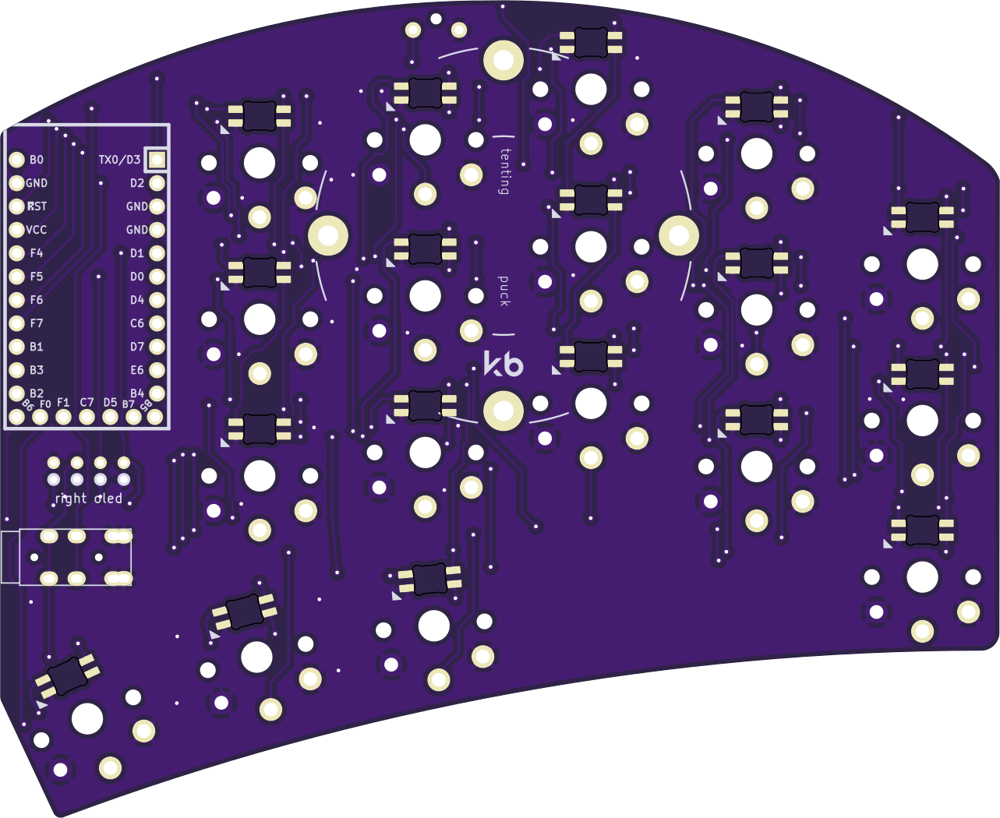
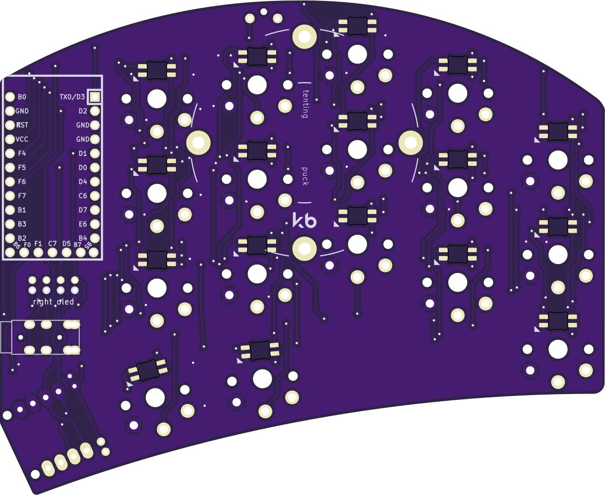
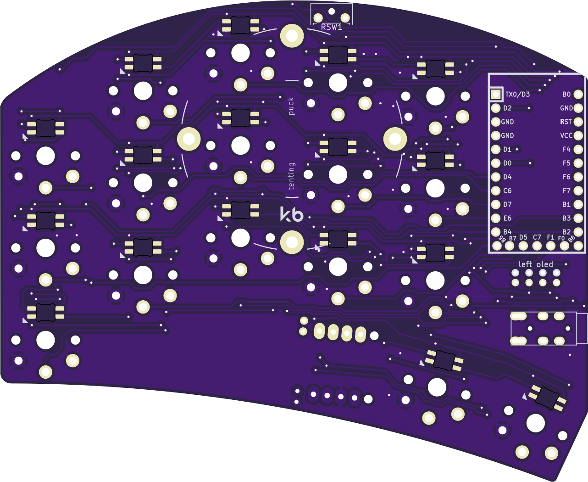
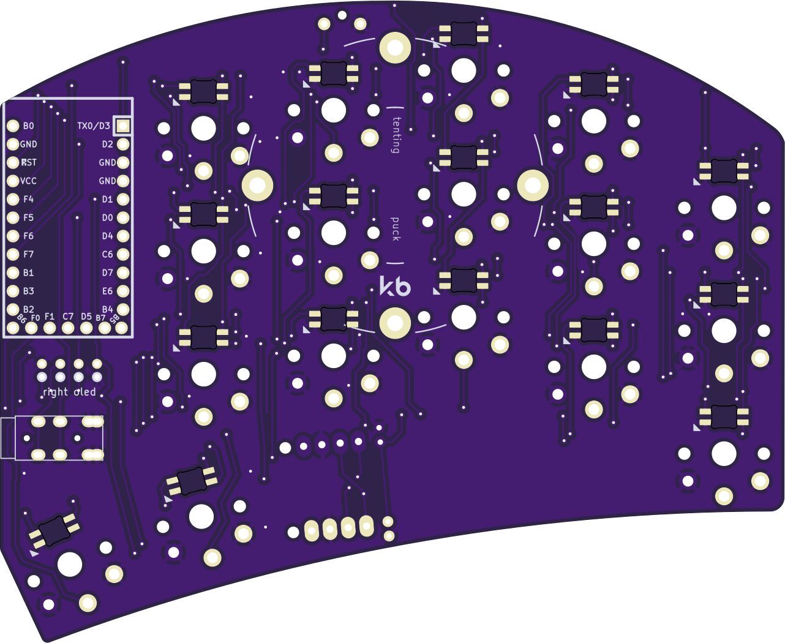
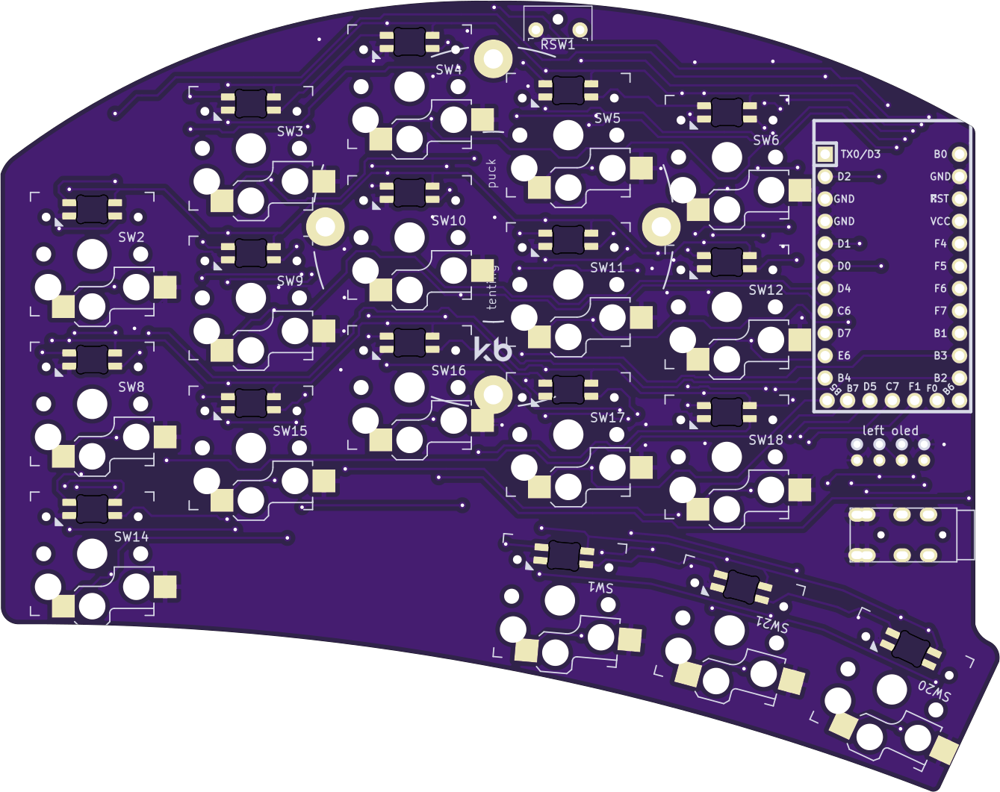
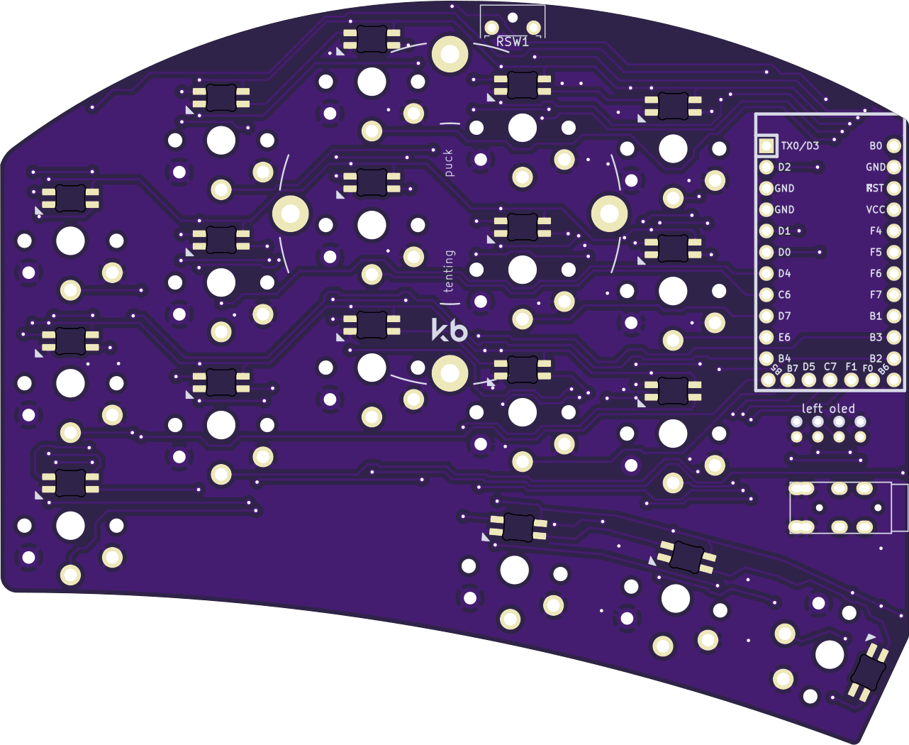
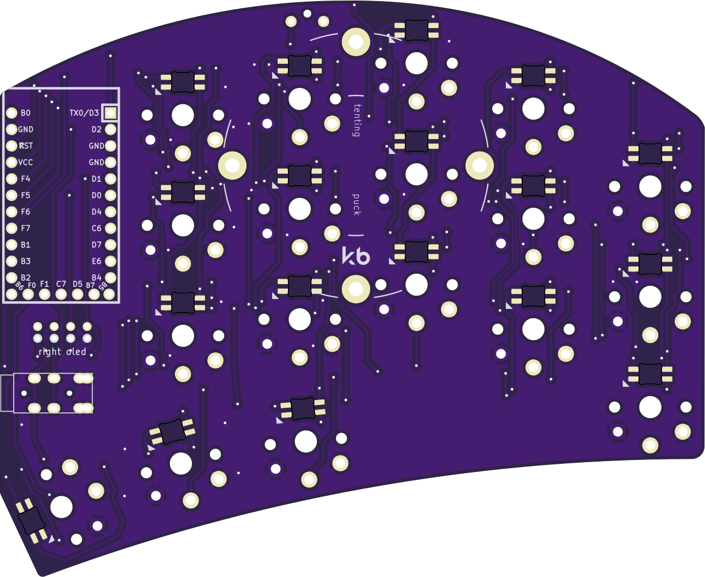
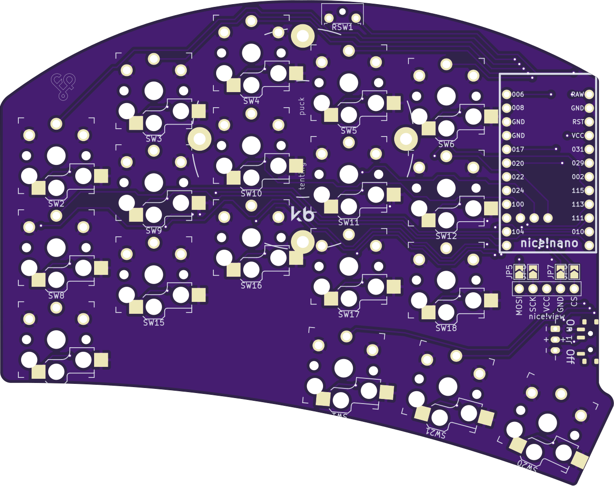
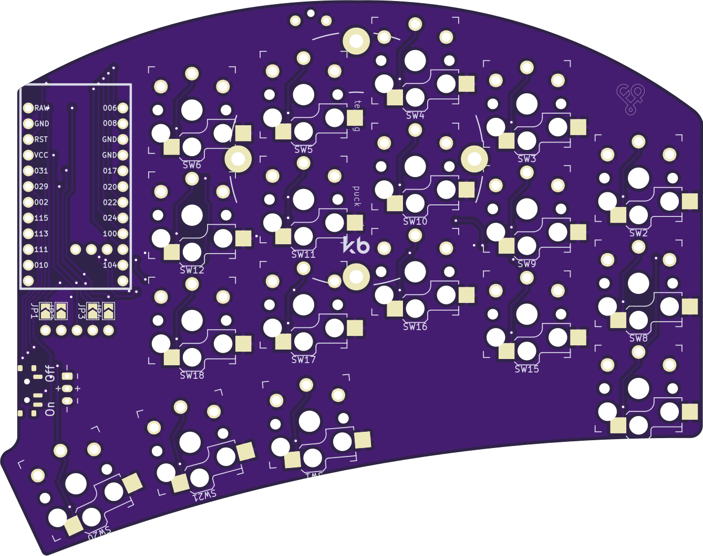

# Name

sweep36

A 36 key version of the sweep, maintaining the original diodeless pcb.

# Variations

## sweeeeep

why the name sweeeeep? because an elite-c is required to support the extra features, and an elite-c has 5 additional pins... so 5 Es for the 5 extra pins. Yes, it's dumb, I know.

### Descripiton

This is a reversible pcb that is wired only, has per key leds (only on one of the two variations), oled, and choc spacing. In order to continue to support a no diode setup, I added support for the elite-c, and this is now required for the build. You can use alternative elite-c compatible controllers.

### Versions and features

There are 6 versions of this pcb, as found in the pcb/wired-rgb directory:
* choc: No hotswap, 36 keys
* choc-rotated-inner-thumb: No hotswap, 36 keys, rotated inner thumb similar to the corne
* choc-hotswap: Hotswap only, 36 keys
* ks27-choc: Support for both choc and gateron ks-27 switches, no hotswap. Note that ks-27 switches use MX keycaps on a low profile switch. Given it's choc spacing, you will likely need to use custom smaller MX keycaps if using these switches
* choc-evq-inside: No hotswap, 34 key, with an evqwgd001 roller encoder on the inside thumb key
* choc-evq-outside: No hotswap, 34 key, with an evqwgd001 roller encoder on the outside thumb key

## swweeep

So, to keep the silliness going, this is has an extra W for the wireless only, and 3 Es for the 3 extra required pins on the nice!nano.

### Description (and story)

This was created after the sweeeeep as a wireless alternative. Given the nice!nano has two less gpio than the elite-c, had to remove the data pin (and therefore TRRS). So, this is wireless only!

Given it's a wireless only build, it made sense to add nice!view support, given it consumes 1000x less power than the typical OLED. That meant that it would consume one too many gpio. In the spirit of low power consumption, removing per key rgb was a natural decision, leaving it with just enough gpio for this board.

So, backstory aside, the net of it is:
* nice!nano required
* nice!view support
* wireless only (no TRRS)
* JST spaced battery through holes
* on/off switch
* both kailh hotswap and mill max compatible through hole

Special thanks to @jasonhazel for kickstarting the initiative!

### Notes

Regarding the JST footprint, you can solder directly or use jst. If soldering, connect power to the middle hole (with the +) and GND to the -. If using JST, be sure to look at your battery wiring and connect the JST connector such that the power lines up with the middle pin (again, with thhe + on the silkscreen)

# Support me!

I have spent a lot of time and money designing prototypes, testing, developing, etc. Any contributions would be greatly appreciated!

If you don't want to, or can't afford to support me, please send me a message to let me know you've built one, along with pictures. Also, feel free to submit a pull request with pictures into this repository. I'd be happy to showcase your build.

Reddit: /u/sadekbaroudi
Discord: sadekbaroudi#1258

# Firmware

## Vial (wired version only)

Special thanks to [Jason Hazel](https://github.com/jasonhazel) for adding vial support. Note that given vial with split code takes up most of the space, there is no support for the OLED or per key RGB. If you want those features, please use QMK below.

https://github.com/sadekbaroudi/vial-qmk/tree/vial/keyboards/fingerpunch/sweeeeep

## QMK (wired version only)

https://github.com/sadekbaroudi/qmk_firmware/tree/master/keyboards/fingerpunch/sweeeeep

## ZMK (wireless version only)

https://github.com/sadekbaroudi/zmk-swweeep

# swweeep v1.3 fix

If you built a swweeep v1.3 or earlier, you will need to connect the battery ground pin to the controller gnd pin, as shown below:

# Pictures

## swweeep with nice!view

## sweeeeep choc

## sweeeeep evq inside

### sweeeeep (choc)
| Front | Back |
| :---: | :---: |
|  |  |

### sweeeeep (choc-evq-inside)
| Front | Back |
| :---: | :---: |
|  |  |

### sweeeeep (choc-evq-outside)
| Front | Back |
| :---: | :---: |
|  |  |

### sweeeeep (choc-hotswap)
| Front | Back |
| :---: | :---: |
|  |  |

### sweeeeep (choc-rotated-inner-thumb)
| Front | Back |
| :---: | :---: |
|  |  |

### sweeeeep (ks27-choc)
| Front | Back |
| :---: | :---: |
|  |  |

### swweeep (choc-hotswap-optional)
| Front | Back |
| :---: | :---: |
|  |  |
